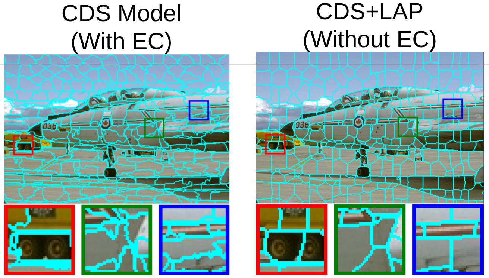

# Differentiable Laplacian Matrix Guided Superpixel Segmentation

This readme contains the code for the work entitled "Differentiable Laplacian Matrix Guided Superpixel Segmentation" for CVPR 2026.
We included our preprocessed data from BSD 500, and they are publicly available here. 

These models were trained on various Nvidia GPUs. The majority of training was completed on the 3070 Ti and RTX A5000. The models SCN and CDSpixel (aka CDS)
work on all gpus listed, they required at most 8 GB of gpu memory. AInet required more and SSM requires much more, around 24 GB. SSM also 
requires nvcc compilation and needed two A5000 gpus. This repo was tested on  Ubuntu version 22.04.5. with Nvidia driver version 535.288.01 and CUDA version 12.2 with Pycharm IDE and Python version 3.10. 
Note the code does not work with Python version 3.13. The code is primarily Python with some C code compiled with Cython, bash scripts to run the models, and MATLAB for plotting. The installation time for 
running the demo is about 0.5 hours.

# File Hierarchy

- zipdownloads/
- databsd/
- weights/
- datasets/
- eval_spixel/
- models/
- results/
- utils/

Other directories
- .venv/
- assets/
- build/

# Data and Weight Download
The following commands will download the zipped data and weights and unzip it:
```bash
mkdir zipdownloads
# wget TODO:update.zip  -P ./zipdownloads/
#wget  TODO:weights.zip -P ./weights/
mkdir databsd 
mkdir weights

unzip -q ./zipdownloads/data.zip -d ./databsd
unzip -q ./zipdownloads/weights.zip -d ./weights/
```

Your data folder for the BSD 500 preprocess images should look like the following
- databsd
  - ground_truth_preprocess 
  - images_preprocess
  - ssm_edges

Please note the weights provided here also include weights from original work SCN, AInet, CDS, SSM and the LAP weights for each model.

# Setup virtual environment

```bash
python3 -m venv ./.venv
source ./.venv/bin/activate
```
You will need to install pytorch. This code used pytorch version 2.4.0 with pytorch-cuda=12.1. There is a constraint file because some of the code 
needs numpy version less than 2. This is specifically for the enforce_connectivity Cython, which needs to updated for numpy version > 2.

```bash
pip install torch==2.4.0 torchvision==0.19.0 torchaudio==2.4.0 --index-url https://download.pytorch.org/whl/cu121
pip install -r requirements.txt -c constraints.txt
python setup.py build_ext --inplace
pip install -e .
```

# Available models
This code and paper used four baselines for retraining with LAP. The LAP loss does not modify model architectures. 

| Model Name | Params (M) | Link |
| -------- | -------- | -------- |
| SCN    |     2.3     |      [code](https://github.com/fuy34/superpixel_fcn/tree/master)    |
| AInet    |      6.0    |     [code](https://github.com/YanFangCS/AINET/tree/main)     |
| CDS    |      0.65    |   [code](https://github.com/rookiie/CDSpixel/tree/main)       |
| SSM    |      72.8    |     [code](https://github.com/jiaxhm/SSMamba/tree/main)     | 


# Model Training

The code is currently setup up to run the cds model +LAP from scratch. This will run the first stage of training where the train and val are separated
and we want to find the epoch where the val loss is minimum. 

```bash
mkdir ./results/
./submit_job.sh
```

After this is complete, you need to edit the script to run tv (trainval as a single dataset). Please see submit_job.sh
for more details. After this script is complete, you grab the last epoch weights and proceed to the test inference.

# Test inference

This requires installation of common benchmarking application used across all baselines. The code is called superpixel-benchmark this a [link]( https://github.com/davidstutz/superpixel-benchmark.git) to the git repo.
The installation procedure has changed because of the date of the repo. For details of some library changes please see install_benchmark.sh

```bash
sudo apt-get install libopencv-dev libgoogle-glog-dev libboost-all-dev libpng++-dev cimg-dev cimg-doc cmake # install dependencies
./install_benchmark.sh
```

The benchmarking code wants the test data in a specific folder. Additionally, the original semantic label data was stored in .mat files, the .csv files have been provided to you. 
The benchmarking code requires .csv files also in a specific folder. 

```bash
rm -rf ./superpixel-benchmark/data/BSDS500/images/test/ # these do not include the full set of test images and labels
rm -rf ./superpixel-benchmark/data/BSDS500/csv_groundTruth/test/

cp -r ./databsd/images_preprocess/test ./superpixel-benchmark/data/BSDS500/images/
cp -r ./databsd/ground_truth_preprocess/test ./superpixel-benchmark/data/BSDS500/csv_groundTruth

mkdir ./results/test_set
./inference.sh
./inference_new_metrics.sh
```

For plotting please see eval_spixel/plot_metrics.m.

# License
Please see the attached MIT license.

# Citation

```
@inproceedings{juybari2026differentiable,
  author    = {Juybari, Jeremy and Hamilton, Josh and Das, Shuvra and Chen, Chaofan and Khalil, Andre and Zhu, Yifeng},
  title     = {Differentiable Laplacian Matrix Guided Superpixel Segmentation},
  booktitle = {Proceedings of the IEEE/CVF Conference on Computer Vision and Pattern Recognition (CVPR)},
  month     = {June},
  year      = {2026}
}

```

# References and Code Acknowledgments

The SCN code was primarily utilized in developing this code. AInet, CDS and SSM also use the SCN code base. We also include code from those
repos (links above). If using another model in your work please also consider citing thier work. We also use the [superpixel-benchmark](https://github.com/davidstutz/superpixel-benchmark.git) repo. 
